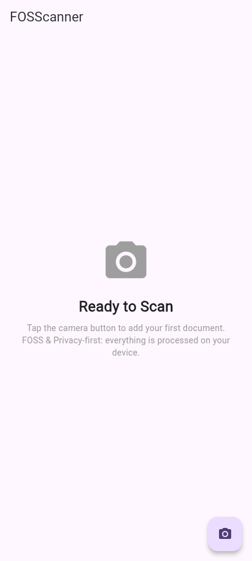
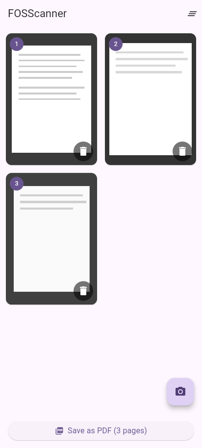

<div align="center">

# FOSScanner

**A privacy-first, free and open-source document scanner.**

Scan documents with your camera, auto-crop and dewarp them, and export a
PDF — all on-device. No accounts, no cloud, no tracking.

[](LICENSE)
[](https://github.com/FOSScanner/fosscanner-app/actions/workflows/ci.yml)
[](https://github.com/FOSScanner/fosscanner-app/releases/latest)

<a href="https://github.com/FOSScanner/fosscanner-app/releases/latest">
  
</a>

Grab `app-arm64-v8a-release.apk` from the release's assets — that's the
right build for virtually every phone from the last ~7 years. Prefer a
32-bit or x86 device? Use `armeabi-v7a` or `x86_64` instead.

<br>

 

*Captured from the Android build.*

</div>

## Features

- Real document scanning, not just a photo: automatic edge detection with
  a draggable corner overlay to fine-tune it, then perspective correction
  (dewarping) into a flat, upright page
- Scan filters — Original, Auto-Enhance, Grayscale, and Black & White —
  with live thumbnail previews before you confirm
- Re-edit any page after the fact (corners, filter, rotation, brightness,
  and contrast) without re-scanning
- Capture multiple pages in sequence and reorder them with drag-and-drop
- Automatically restore an unfinished draft after a native app restart
- Import existing photos from your gallery instead of (or alongside)
  capturing new ones
- Combine captured pages into a single PDF
- On Android, export a searchable PDF with selectable, copyable text using
  bundled Latin-script OCR; iOS exports image-only PDFs
- Share the PDF via the OS share sheet
- Material 3 UI that follows the system's light/dark theme
- No accounts, no cloud storage, no tracking
- An in-app About screen (the ⓘ icon) shows the exact running version and
  links straight to this source repo

FOSScanner supports Android and iOS. Edge detection, perspective correction,
and filters run on real OpenCV (`opencv_dart`) on both mobile platforms.

## Privacy

- All image processing and PDF generation happens on-device.
- Android searchable PDF recognition uses a bundled, offline Latin-script
  Tesseract model; no OCR text or images are sent over the network.
- Imported gallery originals are never modified or deleted. App-owned camera
  temp files are removed after the app attempts to copy their bytes into
  memory (including failed reads).
- Unfinished drafts are saved automatically in the app's
  private, OS-managed application cache. They survive normal process death and
  app restarts, but caches are transient and can be purged by the OS under
  storage pressure; they are not durable storage or included in Android OS
  backups. A draft includes both original and processed page images plus
  crop/filter/edit settings. Atomic staging plus one backup generation can
  retain the current and immediately previous draft contents. Draft data is
  also removed when you confirm **Clear all**, choose **Clear draft** after
  sharing, clear the app's storage, or uninstall the app. Sharing does not
  delete a draft unless you explicitly choose that option.
- PDF sharing starts from in-memory bytes. Depending on the platform,
  `share_plus` may materialize a copy in the app/OS cache for the receiving app;
  that cache is OS-managed and is not guaranteed to disappear immediately
  after the share sheet closes.
- The app makes no network requests of its own.

## Getting started

Requires Flutter `>=3.44.0` with Dart `>=3.12.0 <4.0.0` (matching the
locked dependency resolution and `pubspec.yaml`).

```bash
flutter pub get
flutter run
```

### Useful commands

| Command | Purpose |
|---|---|
| `flutter analyze` | Static analysis / lint |
| `flutter test` | Run the test suite |
| `flutter build apk --release --split-per-abi` | Build signed, per-ABI release APKs (requires `android/key.properties`) |
| `flutter build ios --no-codesign` | Build the iOS app (on macOS) |

### Running with Docker

`docker-compose.yml` provides an Android APK build service using the pinned
Flutter 3.44.0 container image, so you don't need the Flutter/Android SDKs
installed locally. The APK service uses the image's x86_64 Android SDK/NDK toolchain;
Docker Desktop uses emulation automatically on Apple Silicon, so that build is
slower there. Native arm64 Linux Docker engines need amd64 emulation (for
example, binfmt/QEMU) for the APK service:

```bash
# Debug Android APKs (one per ABI), output to ./docker-output/
docker compose run --rm build-apk
```

## Contributing

Issues and pull requests for Android and iOS are welcome — see
[CONTRIBUTING.md](CONTRIBUTING.md) for the dev workflow and commit message
conventions.

## License

FOSScanner is licensed under the [GNU General Public License v3.0](LICENSE).
